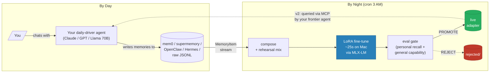

# DreamAgent

> **Memories belong in weights, not vectors.**
> Every other agent memory system in 2026 (mem0, Letta, Supermemory, Zep) consolidates your memories into text you retrieve. DreamAgent consolidates them into **the weights of a small model that runs on your laptop**, via nightly LoRA fine-tuning with eval-gated promotion and one-command rollback. It's the memory specialist your frontier agent calls when it needs to know who you are.

<p>
  <a href="LICENSE"></a>
  <a href="https://www.python.org/downloads/"></a>
  
  <a href="docs/tuning/llama-3.2-1b-instruct-4bit.md"></a>
  <a href="CITATION.cff"></a>
</p>

---

## DreamAgent vs. The Field

| | [mem0](https://github.com/mem0ai/mem0) | [Letta](https://github.com/letta-ai/letta) | [Supermemory](https://supermemory.ai/) | **DreamAgent** |
|---|---|---|---|---|
| Paradigm | Vector + graph + entity | Hierarchical text blocks | Vector index | **LoRA weights** |
| Where memory lives at query time | External index | Memory blocks | Cloud | **In the model** |
| Cross-memory reasoning | Within retrieved chunks | Within context blocks | Within retrieved chunks | **Across all trained memories** |
| Local-only | Self-host option | Yes | No (cloud) | **Yes (Apple Silicon native)** |
| Switching cost from frontier model | Use their SDK | Use their runtime | Use their API | **Zero — it's a backend** |
| LoCoMo benchmark | 92.5%* | 83.2% | ~70% | [Different axis](docs/comparison/README.md) |
| Failure mode | "Found nothing similar" (silent) | Limited context | Server error | **Eval gate REJECT, rollback** |

*\*mem0's self-reported number on their April 2026 algorithm. Independent measurements vary 66-92.5%. See [comparison docs](docs/comparison/README.md).*

**DreamAgent is on a different axis than the retrieval incumbents.** They consolidate to text; we consolidate to weights. In production we **compose** with them, we don't replace them. See [`docs/comparison/`](docs/comparison/) for honest head-to-heads with each.

---

## The Idea



By day, an upstream memory system (any of the existing ones) emits `MemoryItem` records — that part is solved. By night, DreamAgent consolidates them into the **weights** of a small open-source model via LoRA fine-tuning. The trained model is "the guy who knows" — a memory specialist any larger agent can query as a knowledge oracle.

Like sleep moves the day's experiences from hippocampus to neocortex, DreamAgent moves your memories from retrieval to parametric knowledge.

---

## Why This Matters

1. **Privacy is structural.** Memories are consolidated locally on Apple Silicon. They never traverse a third-party API to become parametric. EU AI Act, HIPAA, financial: all viable.
2. **Reasoning, not retrieval.** A vector index returns the closest chunks. A dreamed model *understands the connections* — because it saw all memories together during training. See the [cross-memory reasoning benchmark](benchmarks/cross_memory_reasoning.py).
3. **Cross-agent memory.** Switch your daily-driver from Claude to GPT to local Llama whenever. Your DreamAgent travels with you and exposes the same MCP backend.
4. **The roadmap derisks itself.** V1 is a viability proof on a 1B model. V2 ships that model as a real product. V3 — applying the technique to frontier-scale — only runs if V2 proves itself first.

---

## Quickstart

```bash
git clone https://github.com/mrdulasolutions/dreamagent.git
cd dreamagent
uv sync

# Extract memories from raw text via a frontier LLM
export ANTHROPIC_API_KEY=sk-ant-...
uv run dreamagent extract \
    --from my-chat.txt \
    --backend anthropic \
    --output memories.jsonl

# Run the nightly dream pipeline
uv run dreamagent dream \
    --source memories.jsonl \
    --validation-tier \
    --base-model "mlx-community/Llama-3.2-1B-Instruct-4bit" \
    --iters 90 --num-layers 4 --learning-rate 3e-5 \
    --anchor-ratio 0.30 --max-anchors 60

# Schedule it nightly (macOS launchd / Linux cron)
uv run dreamagent install-cron
```

After the first successful run, `runs/snapshots/live/adapter/` holds your first dreamed adapter. See [`examples/01-quickstart`](examples/01-quickstart/) for a 5-minute end-to-end recipe; [`examples/`](examples/) has six more.

---

## V1 Viability — Reproduced, Not Just Claimed

Pass 1 of the verification protocol completed on Llama 3.2 1B Instruct after 16 documented tuning runs. The locked recipe is in [`docs/tuning/llama-3.2-1b-instruct-4bit.md`](docs/tuning/llama-3.2-1b-instruct-4bit.md).

| Metric | Result | Notes |
|---|---|---|
| Base model | `mlx-community/Llama-3.2-1B-Instruct-4bit` | 1B params, 4-bit quantized |
| Memories trained | 50 fixtures (all 5 `kind` values) | covers fact / preference / procedure / event / correction |
| Training time | ~25 seconds | Apple Silicon M-series |
| Personal recall (held-out probes) | **46%** | vs **0%** baseline |
| General capability (base) | 93% (28/30) | shipped general-eval set |
| General capability (adapter) | 90% (27/30) | **3.3pp regression — clean PROMOTE** |
| Eval gate decision | ✅ **PROMOTE** | no warning |
| End-to-end reproducibility | ✅ | one `dreamagent dream` invocation from a fresh clone |

The path to this clean PROMOTE went through one major model switch (Qwen 3 0.6B abandoned due to chain-of-thought conflict) and 15 prior runs that landed at PROMOTE_WITH_WARNING or REJECT. The [tuning log](docs/tuning/) documents every step.

---

## Benchmarks

Reproducible validation harness in [`benchmarks/`](benchmarks/). Each benchmark is a single `python -m benchmarks.<name> --snapshot ...` invocation that writes a JSON report.

| Benchmark | Status | What it measures |
|---|---|---|
| [`personal_recall`](benchmarks/personal_recall.py) | ✅ runnable | Adapter recalls training memories from weights |
| [`general_capability`](benchmarks/general_capability.py) | ✅ runnable | Catastrophic forgetting on the anchor probe set |
| [`cross_memory_reasoning`](benchmarks/cross_memory_reasoning.py) | ✅ runnable | The parametric advantage: probes requiring 2-3 memories synthesized |
| [`query_latency`](benchmarks/query_latency.py) | ✅ runnable | p50/p95/p99 query latency on the dreamed model |
| [`identity_drift`](benchmarks/identity_drift.py) | ✅ runnable | Persona preservation across nights |
| `locomo_compat` | 🚧 V2 target | DreamAgent on the standard agent-memory benchmark |
| `vs_baselines/*` | 🚧 V2 target | Same memory set through mem0/Letta — head-to-head on the axes that matter |

We don't publish LoCoMo numbers we haven't measured. We don't cherry-pick. See [ADR-007](docs/adr/007-parametric-vs-retrieval-positioning.md) for the positioning rationale.

---

## Architecture

```
src/dreamagent/
    schema.py       — MemoryItem & MemoryBatch (pydantic v2 strict)
    ingest/         — connectors emitting MemoryItems (JSONL / Fixture / Mem0 / …)
    extract/        — frontier-LLM extraction (Anthropic / OpenAI / Ollama)
    compose/        — templates · examples · rehearsal mix · anchors
    train/          — MLX-LM LoRA wrapper · config · lineage metadata
    eval/           — substring-match scoring · personal + general probes
    promote/        — 4-decision eval gate · snapshot · rollback
    merge/          — weekly mergekit consolidation (V2, scaffolded)
    serve/          — MLX-LM / Ollama / MCP hot-swap (V2, scaffolded)
    cli.py          — typer entry point
```

See [`docs/ARCHITECTURE.md`](docs/ARCHITECTURE.md) for the full module walkthrough; [`docs/METHODOLOGY.md`](docs/METHODOLOGY.md) for the technique definition; [`docs/adr/`](docs/adr/) for the 7 ADRs covering major decisions.

---

## Frontier Model Integration

`dreamagent extract` converts arbitrary text into validated `MemoryItem`s via a precision-engineered system prompt that:

- Enforces a strict 5-kind taxonomy with discriminating examples
- Forbids fabrication (lower confidence over guessing)
- Skips ephemeral content
- Refuses to extract sensitive data (passwords, credentials, SSNs)
- Outputs a JSON array validated record-by-record against the pydantic schema

Three backends ship as optional dependencies (`dreamagent[anthropic|openai|ollama]`). Bring your own API key — DreamAgent is BYOK by design.

---

## Roadmap

| Version | Status | Goal |
|---|---|---|
| **V1 — Viability Proof** | ✅ Pass 1 done | Demonstrate consolidation works on a small model with eval-gated safety |
| **V2 — Memory Specialist** | 🔬 in design | MCP / HTTP / library backend any agent can query — the actual product |
| **V3 — Frontier Direct** | ⏸ conditional | Apply the recipe to 70B+ models on cloud GPUs |

Full version targets and metrics in [`ROADMAP.md`](ROADMAP.md).

---

## Documentation

- [`README.md`](README.md) ← you are here
- [`docs/METHODOLOGY.md`](docs/METHODOLOGY.md) — what DreamAgent is, formally
- [`docs/ARCHITECTURE.md`](docs/ARCHITECTURE.md) — module-by-module walkthrough
- [`docs/comparison/`](docs/comparison/) — head-to-heads vs mem0 / Letta / Supermemory / Zep / giant context
- [`docs/tuning/`](docs/tuning/) — per-model tuning playbook with locked recipes
- [`docs/adr/`](docs/adr/) — Architecture Decision Records (7)
- [`ROADMAP.md`](ROADMAP.md) — public roadmap with concrete targets
- [`FAQ.md`](FAQ.md) — common questions, including "why not just mem0?"
- [`SECURITY.md`](SECURITY.md) — threat model + disclosure
- [`CONTRIBUTING.md`](CONTRIBUTING.md) — how to land changes
- [`CHANGELOG.md`](CHANGELOG.md) — version history
- [`examples/`](examples/) — seven runnable cookbook recipes

---

## Licensing & Attribution

Licensed under the **Apache License, Version 2.0**. See [`LICENSE`](LICENSE).

The DreamAgent methodology, prompts, fixture data, tuning playbook, and architectural patterns published in this repository were **originated by Mr Dula Solutions** on **2026-05-26**. Per [`NOTICE`](NOTICE), redistribution and derivative works **must** include attribution:

> "Built on the DreamAgent methodology by Mr Dula Solutions
> (https://github.com/mrdulasolutions/dreamagent)"

If you publish academic work using DreamAgent, cite via [`CITATION.cff`](CITATION.cff).

We can't physically stop unauthorized use of the methodology. This repository, its commit history (rooted on the publication date), the dated `NOTICE`, and `CITATION.cff` together establish indisputable provenance — see [ADR-001](docs/adr/001-apache-2.0-with-notice-attribution.md).

---

## Prior Art

DreamAgent stands on substantial prior work — memory consolidation in agentic systems ([mem0](https://github.com/mem0ai/mem0), [Letta / MemGPT](https://github.com/letta-ai/letta), [OpenClaw Dreaming](https://dev.to/czmilo/openclaw-dreaming-guide-2026-background-memory-consolidation-for-ai-agents-585e), [Anthropic's Claude Dreaming](https://letsdatascience.com/blog/anthropic-dreaming-claude-managed-agents-self-improving-may-6)) and continual learning research ([CL-LoRA](https://openaccess.thecvf.com/content/CVPR2025/papers/He_CL-LoRA_Continual_Low-Rank_Adaptation_for_Rehearsal-Free_Class-Incremental_Learning_CVPR_2025_paper.pdf), [SuRe](https://zylos.ai/research/2026-04-09-continual-learning-catastrophic-forgetting-ai-agents), [SleepGate](https://arxiv.org/abs/2603.14517), [Memento](https://arxiv.org/abs/2508.16153)). The distinguishing contribution is the **end-to-end loop**: agent memories → nightly LoRA → eval-gated promotion → memory specialist backend.

Full references in [`docs/METHODOLOGY.md`](docs/METHODOLOGY.md#prior-art-and-where-dreamagent-differs).

---

<sub>Made by [Mr Dula Solutions](https://github.com/mrdulasolutions). If this changes how you think about agent memory, [open an issue and tell us](https://github.com/mrdulasolutions/dreamagent/issues).</sub>
