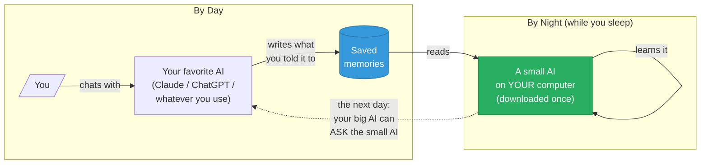

# DreamAgent

> **Your AI assistant, but it actually remembers you.**
> Claude, ChatGPT, and every other AI forgets everything you tell them the moment you open a new chat. DreamAgent fixes that — a small AI on **your computer** learns from your day every night, then becomes the "memory backend" your favorite AI calls when it needs to know who you are. No cloud. No vector database. No subscription. Just an AI that finally remembers your dog's name.

<p>
  <a href="LICENSE"></a>
  <a href="https://www.python.org/downloads/"></a>
  
  <a href="docs/tuning/llama-3.1-8b-instruct-4bit.md"></a>
  <a href="examples/07-mcp-memory-backend/"></a>
</p>

---

## The 30-second version

You probably use Claude or ChatGPT or some other AI every day. You tell it stuff — your job, your dog's name, your preferences, how you like things written, what tools you use. The next day you start a fresh chat and it forgot all of it.

DreamAgent fixes that. Here's how it works:

1. **By day**, you talk to your favorite AI like normal. Things you tell it get saved as "memories" on your computer.
2. **By night**, a small AI living on your computer **reads** what you told it during the day — and literally **learns** it. Not "looks it up" — *learns* it, like a person consolidating their day during sleep.
3. **The next morning**, your big AI (Claude, ChatGPT, whatever you use) can ask the small AI: *"What do you know about Matt?"* — and get a real, reasoned answer.

The small AI becomes "the guy who knows." Your memories never leave your machine. Your favorite AI doesn't change. They just get a new tool to call.



---

## Why this is different from anything else

| | Cloud memory (mem0, ChatGPT memory, Supermemory) | DreamAgent |
|---|---|---|
| **Where your memories live** | On someone else's server | On your computer |
| **What "memory" means** | A database of text snippets your AI searches | A small AI that *actually learned* the memories |
| **What happens when you switch AI** | You start over | DreamAgent comes with you — it works with any AI that supports MCP |
| **What it costs** | Monthly subscription | Free (your laptop, your electricity) |
| **What happens if their company goes under** | You lose access | Nothing — it's all on your machine |

There's a [longer technical comparison](docs/comparison/README.md) if you want it. The short version: **other memory systems retrieve text. DreamAgent gives your AI an actual brain that learned from you.**

---

## Show me it working (5 minutes)

> **Note:** You need a Mac with Apple Silicon (M1, M2, M3, M4) for this. Linux users with a GPU also work; instructions in the docs.

### Step 1 — Install

If you don't have these yet:

```bash
# Install uv (a Python tool installer)
curl -LsSf https://astral.sh/uv/install.sh | sh

# Clone the project
git clone https://github.com/mrdulasolutions/dreamagent.git
cd dreamagent

# Install everything (this downloads ~7GB of model files on first run)
uv sync --extra mcp
```

### Step 2 — Try the included demo

We ship 50 fake memories about a fictional user named Matt — his dog, his preferences, his deploy commands. Let's teach a small AI to remember them:

```bash
uv run dreamagent dream \
    --validation-tier \
    --base-model "mlx-community/Meta-Llama-3.1-8B-Instruct-4bit" \
    --source fixture:v1_baseline \
    --iters 90 --num-layers 8 --learning-rate 3e-5 \
    --anchor-ratio 0.30 --max-anchors 60 \
    --tag my-first-dream
```

This runs the "dreaming" — your computer trains a small AI on the 50 example memories. **First time takes about 15-20 minutes** (mostly downloading the small AI). After that, each "dream" is about 5 minutes.

When it finishes you'll see `PROMOTE` in green. That means it worked.

### Step 3 — Connect it to Claude Code (or Cursor, or any MCP-capable AI)

Open your Claude Code MCP configuration (or use the Claude Code UI to add an MCP server). Add this:

```json
{
  "mcpServers": {
    "dreamagent": {
      "command": "uv",
      "args": ["run", "--directory", "/absolute/path/to/dreamagent", "dreamagent", "serve"],
      "env": {
        "DREAMAGENT_SNAPSHOTS_DIR": "/absolute/path/to/dreamagent/runs/snapshots"
      }
    }
  }
}
```

Replace `/absolute/path/to/dreamagent` with where you cloned it. Restart Claude Code.

### Step 4 — Ask Claude about Matt

In Claude Code, ask:

> Use the dreamagent `query_memory` tool to find out what Matt's dog's name is.

Claude calls the tool. The small AI on your machine answers. Claude shows you the answer. **Matt's dog is named Otis.**

### Step 5 — Use your own memories

The 50 demo memories are a starting point. To add your own:

```bash
# Write or paste a chat transcript into a file
echo "My dog is named Sadie. I prefer concise responses..." > my-memories.txt

# Extract structured memories using your AI of choice
export ANTHROPIC_API_KEY=sk-ant-...  # or OPENAI_API_KEY
uv run dreamagent extract --from my-memories.txt --backend anthropic --output my-memories.jsonl

# Train a new "dream" on YOUR memories
uv run dreamagent dream --source my-memories.jsonl \
    --validation-tier \
    --base-model "mlx-community/Meta-Llama-3.1-8B-Instruct-4bit" \
    --iters 90 --num-layers 8 --learning-rate 3e-5 \
    --anchor-ratio 0.30 --max-anchors 60
```

Now restart Claude Code. When you ask it about yourself, it calls DreamAgent, and gets answers about *you*.

### Step 6 — Run it every night, automatically

```bash
uv run dreamagent install-cron
```

This sets up your computer to automatically "dream" at 3 AM every night. Each morning, your DreamAgent knows a little more than it did yesterday.

---

## Does it actually work?

Yes. We measured it. Here are the numbers:

**The big one:** On questions that require connecting multiple memories together — like *"Given what the user has told me about their projects AND their preferred tools, what command would they likely use to test this?"* — the small AI without dreaming scores **30%**. After dreaming, it scores **90%**. That's a 3× improvement, and it's the kind of question vector-search memory systems literally cannot answer in one shot.

**Other numbers from the night-7 adapter** (after 7 consecutive nights of "dreaming"):

| Test | Result |
|---|---|
| Can it recall what we taught it? | **75%** of held-out questions correct |
| Did dreaming break its general intelligence? | Lost 6.7% — within safe limits, gate-approved |
| How fast does it answer? | About 1 second per question on Mac |
| Did it forget it's an assistant? | Actually got *better* at being an assistant (+12.5%) |

The 7-night stability test: every single night promoted, zero failures. The full data is in [`docs/tuning/llama-3.1-8b-instruct-4bit.md`](docs/tuning/llama-3.1-8b-instruct-4bit.md).

---

## Roadmap

| Version | What it is | Status |
|---|---|---|
| **V1 — Does this actually work?** | Prove the "dream" loop on a small model with safety guardrails | ✅ All 3 passes done |
| **V2 — A memory backend you can use** | Plug DreamAgent into Claude Code / Cursor / etc. as an MCP server | ✅ **V2.0 alpha live now** · V2.1+ in design |
| **V3 — Frontier-scale dreaming** | Apply the same approach to 70B+ models on cloud GPUs | ⏸ Only if V2 evidence makes it worthwhile |

Concrete metric targets per version in [`ROADMAP.md`](ROADMAP.md).

---

## The technical version

If you're a developer / researcher / engineer and want the depth:

- **What this actually is, formally:** [`docs/METHODOLOGY.md`](docs/METHODOLOGY.md) — the **MORPHEUS** methodology (Memory Overnight Re-parameterization, Promotion via Held-out Eval, Update Snapshots). DreamAgent is the reference implementation.
- **How the code is structured:** [`docs/ARCHITECTURE.md`](docs/ARCHITECTURE.md) — module-by-module walkthrough
- **Why every major design decision was made:** [`docs/adr/`](docs/adr/) — 8 Architecture Decision Records
- **How we compare to mem0, Letta, Supermemory, Zep:** [`docs/comparison/`](docs/comparison/)
- **How to tune it for a different base model:** [`docs/tuning/`](docs/tuning/) — per-model playbook with locked recipes
- **Reproducible benchmarks:** [`benchmarks/`](benchmarks/) — every number above is a `python -m benchmarks.<name>` away
- **Common questions:** [`FAQ.md`](FAQ.md)
- **All available commands:** `dreamagent --help`

In one terminal command:

```bash
dreamagent --help
```

You'll see:
- `dream` — the nightly training loop
- `extract` — turn raw text into structured memories
- `ingest` — inspect a memory source
- `serve` — start the MCP server (V2.0)
- `drill` — chained multi-night stability test
- `snapshots` / `rollback` — inspect and revert promoted adapters
- `install-cron` — schedule nightly dreams
- `load-model` — sanity-check the local LLM

---

## A simple architecture diagram

```
src/dreamagent/
    schema.py       — what a "memory" is (the data contract)
    ingest/         — read memories from anywhere (mem0, files, etc.)
    extract/        — turn raw text into memories (uses Claude/GPT/Ollama)
    compose/        — turn memories into training examples
    train/          — actually train the small AI
    eval/           — test that it learned without breaking
    promote/        — decide if tonight's dream is safe to use
    serve/          — expose it as an MCP server (V2.0)
    cli.py          — every command lives here
```

The dream pipeline runs in order: `ingest → extract (optional) → compose → train → eval → promote → serve`.

---

## Frequently asked questions

**Is this safe?** Yes. Every nightly run has automated tests for "did it forget how to be helpful?" If those tests fail, the new memory is rejected and yesterday's safe model stays in charge. Rollback is one command.

**Do I have to give it ALL my chat history?** No. You choose what to teach it. Pass in only the conversations or facts you want it to remember.

**What happens to memories I want to delete?** Tell DreamAgent to drop them, re-run the nightly cycle, and roll back any adapter that learned them. Full GDPR-style deletion protocol in [`SECURITY.md`](SECURITY.md).

**Will it leak my information?** The model is on your computer; nothing ships to a cloud unless you explicitly use the Anthropic or OpenAI backends for the extract step (and you can use a local Ollama instead). The system prompt forbids the model from sharing secrets.

**What if I switch from Claude to ChatGPT next year?** No problem. DreamAgent is an MCP server — anything that supports MCP can use it. Your AI changes; your memory specialist stays the same.

[More questions and answers →](FAQ.md)

---

## Licensing & attribution

Licensed under **Apache 2.0**. See [`LICENSE`](LICENSE).

The methodology DreamAgent implements is called **MORPHEUS** and was originated by **Mr Dula Solutions** on **2026-05-26**. If you build on this work, [`NOTICE`](NOTICE) requires the attribution:

> "Built on MORPHEUS (Memory Overnight Re-parameterization, Promotion via Held-out Eval, Update Snapshots) by Mr Dula Solutions — https://github.com/mrdulasolutions/dreamagent"

Academic citation: see [`CITATION.cff`](CITATION.cff). We can't physically stop someone from using the methodology without credit, but the dated commit history + NOTICE + CITATION + this README together establish provenance.

---

## Prior art

DreamAgent stands on real prior work — memory systems like [mem0](https://github.com/mem0ai/mem0), [Letta / MemGPT](https://github.com/letta-ai/letta), [Supermemory](https://supermemory.ai/), [OpenClaw](https://dev.to/czmilo/openclaw-dreaming-guide-2026-background-memory-consolidation-for-ai-agents-585e), and Anthropic's Claude memory; and continual-learning research like [CL-LoRA](https://openaccess.thecvf.com/content/CVPR2025/papers/He_CL-LoRA_Continual_Low-Rank_Adaptation_for_Rehearsal-Free_Class-Incremental_Learning_CVPR_2025_paper.pdf), [SleepGate](https://arxiv.org/abs/2603.14517), [Memento](https://arxiv.org/abs/2508.16153). The contribution here is the **end-to-end loop** that turns memories into model weights with safety machinery — and the [proof that the resulting model can reason across memories in ways retrieval can't](docs/tuning/llama-3.1-8b-instruct-4bit.md).

Full prior-art tour and positioning in [`docs/METHODOLOGY.md`](docs/METHODOLOGY.md).

---

<sub>Made by [Mr Dula Solutions](https://github.com/mrdulasolutions). If this changes how you think about AI memory — or if you tried it and something broke — [tell us](https://github.com/mrdulasolutions/dreamagent/issues).</sub>
